# ⌘ CodeLens AI

<p align="center">
  <strong>Intelligent, AST-Aware Codebase Retrieval-Augmented Generation (RAG) System</strong>
</p>

<p align="center">
  <a href="https://fastapi.tiangolo.com/"></a>
  <a href="https://streamlit.io/"></a>
  <a href="https://www.langchain.com/"></a>
  <a href="https://qdrant.tech/"></a>
  <a href="https://ollama.ai/"></a>
  <a href="https://groq.com/"></a>
  <a href="https://www.python.org/"></a>
  <a href="./LICENSE"></a>
</p>

---

**CodeLens AI** is an advanced code intelligence assistant that turns entire Git repositories into conversational, verifiable knowledge bases. Unlike traditional RAG systems that blindly slice source files into arbitrary character chunks, CodeLens uses **syntax-aware Abstract Syntax Tree (AST) parsing** to preserve semantic boundaries—such as classes, methods, standalone functions, docstrings, and imports.

Powered by dense vector embeddings, vector similarity search with **Qdrant**, precision cross-encoder re-ranking with **BGE-Reranker**, and flexible LLM backends (**Ollama** or **Groq**), CodeLens answers technical questions with pinpoint citations showing exact file paths, symbol signatures, and line numbers.

---

## 🌟 Key Features

- **🐙 Automated Repository Ingestion**: Clone any public GitHub repository directly from the web UI or API with automatic workspace lifecycle management.
- **🌳 AST-Aware Semantic Chunking**: Deconstructs Python source code using AST into meaningful logical units:
  - Top-level class declarations & docstrings
  - Class methods with parent signatures
  - Standalone functions
  - Module import blocks
  - Fallback chunking for documentation and configuration files (`.md`, `.json`, `.yaml`, `.toml`, `Dockerfile`, etc.).
- **⚡ Dense Vector Embeddings**: Generates high-fidelity code embeddings using `BAAI/bge-small-en-v1.5` through HuggingFace & LangChain.
- **🎯 Qdrant Vector Database**: Scalable vector storage with cosine distance indexing and metadata filtering by `repo_id`, ensuring strict tenant isolation across multiple repositories.
- **🔄 Two-Stage Retrieval with Cross-Encoder Re-Ranking**: Over-fetches candidate chunks from Qdrant and re-ranks them using `BAAI/bge-reranker-base` to eliminate false positives and feed only the most relevant code blocks to the LLM context window.
- **🤖 Dual LLM Provider Support**:
  - **Local & Private**: Run 100% offline using **Ollama** (`llama3.2`, `codellama`, etc.).
  - **Cloud Ultra-Fast**: Leverage blazing-fast cloud inference with **Groq** (`llama-3.3-70b-versatile`, `openai/gpt-oss-20b`, etc.).
- **📍 Verifiable Line-Level Citations**: Every answer provides clickable source cards with file path, symbol hierarchy (`Class → Method`), and line range (`Lines X–Y`).
- **🖥️ Modern Streamlit Dark-Mode Dashboard**: Sleek, developer-first UI with repository status, indexing metrics, and interactive streaming chat.
- **🚀 Production-Ready FastAPI Backend**: Modular service-oriented architecture with typed Pydantic models, health checks, and OpenAPI documentation (`/docs`).

---

## 🏗️ Architecture

```mermaid
flowchart TD
    subgraph Ingestion["📥 1. Ingestion & Indexing Pipeline"]
        A[GitHub Repo URL] --> B[Git Clone Service]
        B --> C[Repository Scanner & File Filter]
        C --> D{Parser Factory}
        D -->|Python Files| E[Python AST Parser]
        D -->|Docs / Configs| F[Text Parser]
        E --> G[Code Chunker: Classes, Methods, Functions, Imports]
        F --> H[Text Chunker]
        G & H --> I[Document Aggregator]
        I --> J[HuggingFace Embeddings: BAAI/bge-small-en-v1.5]
        J --> K[(Qdrant Vector Database)]
    end

    subgraph RAG["🔍 2. Retrieval & Generation Pipeline"]
        L[User Query] --> M[Embedding Service: Embed Query]
        M --> N[Qdrant Vector Search: Filtered by repo_id]
        N --> O[Candidate Code Chunks]
        O --> P[Cross-Encoder Reranker: BAAI/bge-reranker-base]
        P --> Q[Context Builder: Formatted Source Citations]
        Q --> R[RAG Prompt Template]
        R --> S{LLM Service}
        S -->|Local| T[Ollama: llama3.2]
        S -->|Cloud| U[Groq API]
        T & U --> V[Structured Answer + Line-Level Source Citations]
        V --> W[Streamlit UI / API Consumer]
    end
```



---

## 📂 Project Structure

```
CodeLens-AI/
├── backend/
│   ├── app/
│   │   ├── api/                     # API routers & endpoints
│   │   │   ├── github.py            # /github/clone & scan endpoints
│   │   │   ├── health.py            # /health check
│   │   │   ├── rag.py               # /rag/ask endpoint
│   │   │   └── router.py            # Main API router aggregator
│   │   ├── config/                  # Configuration & settings
│   │   │   └── settings.py          # Pydantic BaseSettings (.env loader)
│   │   ├── core/                    # Core application constants
│   │   ├── models/                  # Pydantic request & response schemas
│   │   │   ├── ask.py               # AskRequest model
│   │   │   ├── rag.py               # RAGResponse & Source models
│   │   │   └── retrieval.py         # RetrievedChunk model
│   │   ├── prompts/                 # System and context prompts
│   │   ├── services/                # Business logic & integrations
│   │   │   ├── chunking/            # Code and text chunkers
│   │   │   ├── embeddings/          # HuggingFace embedding services
│   │   │   ├── github/              # Git clone & repo scanner services
│   │   │   ├── indexing/            # End-to-end indexing orchestrator
│   │   │   ├── llm/                 # LLM provider factory (Ollama & Groq)
│   │   │   ├── parser/              # AST & text parser implementations
│   │   │   ├── rag/                 # RAG orchestration & context builder
│   │   │   ├── reranking/           # BGE Cross-Encoder reranker
│   │   │   ├── retrieval/           # Qdrant query & retrieval service
│   │   │   └── vectorstore/         # Qdrant client & collection manager
│   │   ├── utils/                   # Logging & ID generator utilities
│   │   └── main.py                  # FastAPI application entrypoint
│   ├── tests/                       # Unit and integration test suites
│   ├── requirements.txt             # Backend dependencies
│   ├── Dockerfile                   # Backend container definition
│   └── workspace/                   # Local storage for cloned repositories
├── frontend/
│   ├── app.py                       # Streamlit interactive web application
│   └── requirements.txt             # Frontend dependencies
├── docker-compose.yml               # Multi-container orchestration (Qdrant)
├── requirements.txt                 # Project-wide dependencies
└── README.md                        # Documentation
```

---

## 🛠️ Tech Stack

| Component | Technology | Purpose |
| :--- | :--- | :--- |
| **API Framework** | [FastAPI](https://fastapi.tiangolo.com/) | High-performance asynchronous REST API backend |
| **Web Interface** | [Streamlit](https://streamlit.io/) | Modern interactive dark-theme chat UI |
| **Orchestration** | [LangChain](https://www.langchain.com/) | Prompt management & document abstractions |
| **Code Parsing** | Python `ast` | Language syntax tree extraction for classes & functions |
| **Embeddings** | [`BAAI/bge-small-en-v1.5`](https://huggingface.co/BAAI/bge-small-en-v1.5) | Dense vector representations for source code & queries |
| **Vector DB** | [Qdrant](https://qdrant.tech/) | Production-grade vector similarity search with metadata filtering |
| **Re-Ranking** | [`BAAI/bge-reranker-base`](https://huggingface.co/BAAI/bge-reranker-base) | Cross-encoder precision scoring for retrieved context |
| **LLMs** | [Ollama](https://ollama.ai/) / [Groq](https://groq.com/) | Local privacy-focused or blazing-fast cloud generation |
| **Version Control** | [GitPython](https://gitpython.readthedocs.io/) | Automated shallow repository cloning & filesystem inspection |

---

## 🚀 Getting Started

### Prerequisites

1. **Python 3.10+** installed on your system.
2. **Git** installed and available in your `PATH`.
3. **Qdrant**: Running locally via Docker or a Qdrant Cloud instance.
4. **Ollama** (optional, for local inference): [Download Ollama](https://ollama.ai) and pull a model:
   ```bash
   ollama pull llama3.2
   ```
   *or* a **Groq API Key** (optional, for cloud inference): [Get a free Groq key](https://console.groq.com).

---

### Step 1: Clone the Repository

```bash
git clone https://github.com/Parth4070/CodeLens-AI.git
cd CodeLens-AI
```

### Step 2: Set Up Virtual Environment

```bash
# Create virtual environment
python -m venv venv

# Activate on Windows (PowerShell)
.\venv\Scripts\Activate.ps1
# Activate on Windows (CMD)
.\venv\Scripts\activate.bat
# Activate on Linux/macOS
source venv/bin/activate
```

### Step 3: Install Dependencies

```bash
pip install --upgrade pip
pip install -r requirements.txt
```

---

### Step 4: Run Qdrant Vector Database

Start a local Qdrant instance using Docker:

```bash
docker run -d -p 6333:6333 -p 6334:6334 \
    -v qdrant_storage:/qdrant/storage:z \
    --name qdrant qdrant/qdrant
```

Verify that Qdrant is running at [http://localhost:6333/dashboard](http://localhost:6333/dashboard).

---

### Step 5: Configure Environment Variables

Create a `.env` file inside the `backend/` directory:

```env
# Application Settings
APP_NAME="CodeLens AI"
APP_VERSION="1.0.0"
DEBUG=True

# LLM Provider Configuration ("ollama" or "groq")
LLM_PROVIDER=ollama
LLM_MODEL=llama3.2

# If using Groq:
# LLM_PROVIDER=groq
# LLM_MODEL=llama-3.3-70b-versatile
# GROQ_API_KEY=gsk_your_groq_api_key_here

# Qdrant Vector Database Configuration
QDRANT_URL=http://localhost:6333
QDRANT_API_KEY=
```

---

### Step 6: Start the Application

#### 1. Start the FastAPI Backend

From the project root:

```bash
cd backend
uvicorn app.main:app --reload --port 8000
```

The API will be available at:
- **API Base**: `http://localhost:8000`
- **Interactive Swagger Docs**: `http://localhost:8000/docs`
- **ReDoc Documentation**: `http://localhost:8000/redoc`

#### 2. Start the Streamlit Frontend

Open a new terminal session, activate the virtual environment, and launch:

```bash
cd frontend
streamlit run app.py
```

The UI will automatically open in your default browser at `http://localhost:8501`.

---

## 📖 Usage Walkthrough

1. **Enter Repository URL**: In the Streamlit sidebar, paste a public GitHub URL (e.g. `https://github.com/psf/requests` or your own repository).
2. **Click "Clone & Index Repository"**:
   - CodeLens clones the repository to `backend/workspace/`.
   - Filters out non-source directories (`.git`, `node_modules`, `venv`, tests, binaries).
   - Generates AST code chunks and documents.
   - Computes dense vector embeddings and stores them in Qdrant with `repo_id`.
3. **Ask Natural Language Questions**:
   - *"How does the authentication flow work?"*
   - *"Where is the database connection pool initialized?"*
   - *"Explain the responsibilities of the `IndexingService` class."*
   - *"What does function `calculate_hash` do and where is it called?"*
4. **Inspect Source Citations**: Each answer includes expandable cards detailing the exact file name, class/method, and line numbers retrieved.

---

## 📡 API Reference

### Health Check
```http
GET /health
```
**Response:**
```json
{
  "status": "healthy"
}
```

---

### Clone & Index Repository
```http
POST /github/clone
Content-Type: application/json

{
  "repo_url": "https://github.com/fastapi/fastapi"
}
```
**Response:**
```json
{
  "repository": "fastapi",
  "repo_id": "fastapi",
  "path": "workspace/fastapi",
  "document_count": 342,
  "status": "indexed"
}
```

---

### Ask Repository Question (RAG)
```http
POST /rag/ask
Content-Type: application/json

{
  "repo_id": "fastapi",
  "question": "Where is the FastAPI main application class declared?",
  "top_k": 5
}
```
**Response:**
```json
{
  "answer": "The main FastAPI application class is defined in `fastapi/applications.py`. It inherits from Starlette and configures routing, middleware, and OpenAPI schema generation.",
  "sources": [
    {
      "file_path": "fastapi/applications.py",
      "chunk_type": "class",
      "class_name": "FastAPI",
      "function_name": null,
      "start_line": 45,
      "end_line": 180,
      "retrieval_score": 0.892,
      "rerank_score": 0.965
    }
  ]
}
```

---

## 🧪 Testing

CodeLens AI includes a comprehensive test suite covering parsers, chunkers, embedding generators, Qdrant vector storage, and RAG pipelines.

Run the test suite using `pytest`:

```bash
cd backend
pytest -v tests/
```

Individual component tests:
```bash
pytest tests/test_parser.py
pytest tests/test_chunker.py
pytest tests/test_embedding.py
pytest tests/test_qdrant.py
pytest tests/test_retrieval.py
pytest tests/test_rag.py
```

---

## ⚙️ Configuration Reference

| Environment Variable | Type | Default | Description |
| :--- | :--- | :--- | :--- |
| `APP_NAME` | `string` | `CodeLens AI` | Application title |
| `APP_VERSION` | `string` | `1.0.0` | API version tag |
| `DEBUG` | `bool` | `True` | Enable debug mode |
| `LLM_PROVIDER` | `string` | `ollama` | LLM backend: `ollama` or `groq` |
| `LLM_MODEL` | `string` | `llama3.2` | Model name (e.g. `llama3.2` or `llama-3.3-70b-versatile`) |
| `QDRANT_URL` | `string` | `http://localhost:6333` | Host URL for Qdrant vector database |
| `QDRANT_API_KEY` | `string` | `None` | Optional API key for Qdrant Cloud |
| `GROQ_API_KEY` | `string` | `None` | API key required when `LLM_PROVIDER=groq` |
| `CODELENS_API_URL` | `string` | `http://127.0.0.1:8000` | Frontend configuration for FastAPI endpoint |

---

## 🗺️ Roadmap

- [x] Python AST semantic code chunker
- [x] HuggingFace BGE embeddings & Qdrant vector integration
- [x] Cross-Encoder BGE re-ranking pipeline
- [x] Dual Ollama & Groq LLM integration
- [x] Streamlit dark-mode interactive web client
- [ ] Tree-sitter multi-language support (TypeScript, JavaScript, Go, Rust, Java)
- [ ] Codebase dependency graph & call-graph analysis
- [ ] Incremental git diff re-indexing on branch updates
- [ ] Docker Compose full-stack single-command setup

---

## 🤝 Contributing

Contributions are always welcome!

1. Fork the Project
2. Create your Feature Branch (`git checkout -b feature/AmazingFeature`)
3. Commit your Changes (`git commit -m 'Add some AmazingFeature'`)
4. Push to the Branch (`git push origin feature/AmazingFeature`)
5. Open a Pull Request

---

## 📄 License

Distributed under the **MIT License**. See [`LICENSE`](./LICENSE) for more details.

---

<p align="center">
  Built with ❤️ for developers by <a href="https://github.com/Parth4070">Parth Ghag</a>
</p>
